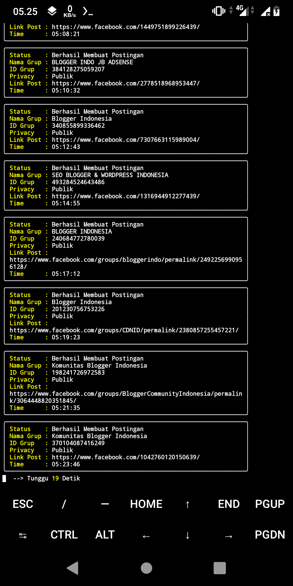

# Auto Posting Facebook Group

# Automation Facebook
Gunakan Script Ini Untuk Mengirim Postingan ke Semua Grup Facebook Anda Secara Otomatis, Cocok Digunakan Untuk Promosi, Iklan, Berbagi Informasi & Sebagainya. Script Ini Juga Aman Untuk Digunakan Pada Akun Utama Asal Tidak Berlebihan Menggunakannya.
### Perintah Termux :
    $ apt update -y && apt upgrade -y
    $ pkg install git
    $ pkg install python3
    $ git clone https://github.com/dafidxcode/AutopostGroupFB
    $ cd AutopostGroupFB
    $ pip3 install -r requirements.txt
    $ python3 Autopost.py

### Update Script :
    $ rm -rf $HOME/AutopostGroupFB
    $ git clone https://github.com/dafidxcode/AutopostGroupFB
    $ cd AutopostGroupFB
    $ python3 Autopost.py

# Selamat Menggunakan
